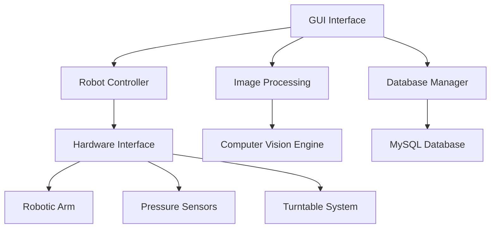

# Robotic Arm Multimeter Testing System

[](https://github.com/project/status)
[](https://python.org)
[](LICENSE)

An automated multimeter testing system that uses computer vision and robotic arm control to perform precision multimeter calibration and testing with automated probe insertion and measurement reading.

---

##   Table of Contents

- [Project Overview](#-project-overview)
- [System Architecture](#-system-architecture)
- [Installation & Setup](#-installation--setup)
- [Hardware Requirements](#-hardware-requirements)
- [Software Components](#-software-components)
- [Project Structure](#-project-structure)
- [Development Status](#-development-status)
- [Usage Guide](#-usage-guide)
- [Refactoring Documentation](#-refactoring-documentation)
- [Contributing](#-contributing)
- [Development Roadmap](#-development-roadmap)
- [Support](#-support)

---

##   Project Overview

### Objective
This project implements fully automated multimeter testing using computer vision recognition and robotic arm automation. The system combines precision robotics, advanced computer vision, and sophisticated data management to create an industrial-grade testing platform.

### Key Capabilities
- **Automated Testing**: Robotic probe insertion and measurement execution
- **Computer Vision**: LCD digit recognition and QR code scanning using neural networks
- **Database Management**: Comprehensive test data storage and retrieval
- **Report Generation**: Automated test result analysis and professional reporting
- **Equipment Management**: Multi-multimeter mounting and positioning control
- **Quality Assurance**: Precision measurement with pressure feedback monitoring

### Current Status
**  70% Complete - Active Development Phase**

The system has strong foundational components with core functionality implemented. Primary remaining work focuses on GUI completion and system integration testing.

---

##  ? System Architecture

### Core Components



### Technology Stack
- **Framework**: Python 3.8+ with PySide2 GUI
- **Computer Vision**: OpenCV, PyTorch for neural network digit recognition
- **Robotics**: 6-DOF robotic arm with gripper and pressure feedback
- **Database**: MySQL for test data and configuration management
- **Communication**: Serial interface for microcontroller integration

---

##   Installation & Setup

### Prerequisites
- Python 3.8 or higher
- MySQL Server
- Git (for version control)
- Virtual environment tool (recommended)

### Installation Steps

1. **Clone Repository**
   ```bash
   git clone <repository_url>
   cd Robotics
   ```

2. **Create Virtual Environment** (Recommended)
   ```bash
   python -m venv venv
   
   # Windows
   venv\Scripts\activate
   
   # Linux/Mac
   source venv/bin/activate
   ```

3. **Install Dependencies**
   ```bash
   pip install -r requirements.txt
   ```

4. **Database Setup**
   ```bash
   # Configure MySQL connection in system_config.py
   # Import database schema (if provided)
   mysql -u root -p robot < database_schema.sql
   ```

5. **Hardware Configuration**
   ```bash
   # Update hardware settings in system_config.py
   # Verify robot IP address and serial ports
   ```

6. **Launch Application**
   ```bash
   python multimeter_gui.py
   ```

---

##   Hardware Requirements

### Required Equipment
| Component | Specification | Purpose |
|-----------|---------------|---------|
| **Robotic Arm** | 6-DOF with gripper, Fairino FR series | Precise probe manipulation |
| **Camera System** | High-resolution USB camera | Computer vision and QR code reading |
| **Standard Source** | Precision signal generator | Calibration reference signals |
| **Pressure Sensors** | High-precision pressure feedback | Probe insertion monitoring |
| **Turntable** | Multi-position equipment holder | Multimeter positioning |
| **Microcontroller** | Arduino/similar for hardware coordination | System integration |

### Communication Interfaces
- **Robot Controller**: Ethernet (192.168.58.2)
- **Microcontroller**: Serial (COM7, 9600 baud)
- **Camera**: USB interface
- **Database**: TCP/IP (localhost:3306)

### Workspace Requirements
- **Operating Area**: 1m x 1m minimum workspace
- **Safety**: Emergency stop accessible, proper lighting
- **Power**: Stable 220V supply for robot and peripherals

---

##   Software Components

### GUI Applications (`multimeter_gui.py`)
| Class | Purpose | Status |
|-------|---------|--------|
| `SystemInitializer` | Hardware communication testing and startup | ? Complete |
| `MultimeterInterface` | Main navigation and operation control | ? Complete |
| `EquipmentManager` | Multimeter mounting and positioning |   Partial |
| `MeasurementRunner` | Automated test execution |   Partial |
| `ManualMeasurementRunner` | Manual measurement operations |   Partial |
| `TurntableController` | Turntable rotation control | ? Complete |
| `NewMultimeterRegistration` | New equipment model registration | ? Complete |
| `ReportGenerator` | Test result analysis and export | ? Planned |
| `DataManager` | Data import/export management | ? Planned |
| `DataQueryInterface` | Database query operations | ? Planned |

### Control Systems (`robot_controller.py`)
| Class | Purpose | Status |
|-------|---------|--------|
| `RobotController` | High-level robot arm coordination | ? Complete |
| `ProbeHandler` | Probe insertion and manipulation | ? Complete |
| `MicrocontrollerCommunication` | Serial hardware interface | ? Complete |
| `PressureMonitor` | Pressure sensor feedback monitoring | ? Complete |

### Computer Vision (`image_processing.py`)
| Function | Purpose | Status |
|----------|---------|--------|
| `recognize_digits_neural_network()` | PyTorch-based digit recognition | ? Complete |
| `recognize_single_digit()` | Traditional pattern recognition | ? Complete |
| `detect_lcd_screen()` | LCD area detection and extraction | ? Complete |
| `process_qr_code()` | QR code detection and decoding | ? Complete |
| `capture_image()` | Camera interface and image capture | ? Complete |

---

##   Project Structure

### Current File Organization

```
Robotics/
         Core Application Files
            multimeter_gui.py          # Main GUI application (refactored)
            image_processing.py        # Computer vision module (refactored)
            robot_controller.py        # Robot control module (refactored)
            system_config.py           # Configuration constants
  
         Legacy Files (Pre-Refactoring)
            wyb_gui.py                 # Original GUI (Chinese naming)
            ewm_and_lcd_formal.py      # Original image processing
            robot_act_new.py           # Original robot controller
  
         Supporting Modules
            standard_source_controller.py  # Signal source control
            export.py                   # Data export functionality
            MvCameraControl_class.py    # Camera SDK integration
            [camera control files]      # Hardware interface modules
  
         Documentation
            README.md                   # This comprehensive guide
            NAMING_CONVENTION.md        # Coding standards
            PROJECT_EVALUATION.md       # Development status analysis
            [other documentation]       # Additional guides
  
         Configuration
            requirements.txt            # Python dependencies
            fairino_related/           # Robot SDK and examples
  
         Resources
           ui/                        # GUI interface files
           models/                    # ML models for digit recognition
           [data directories]         # Test data and exports
```

### File Transformation Mapping

| **Legacy File** | **Refactored File** | **Primary Changes** |
|-----------------|---------------------|---------------------|
| `wyb_gui.py` | `multimeter_gui.py` | English naming, modular classes, comprehensive documentation |
| `ewm_and_lcd_formal.py` | `image_processing.py` | Standardized function names, type hints, error handling |
| `robot_act_new.py` | `robot_controller.py` | Class-based architecture, safety improvements, database integration |

---

##   Development Status

### ? Completed Components (70% of Core Functionality)

#### **System Architecture & Configuration**
- ? Comprehensive configuration management (`system_config.py`)
- ? Environment validation and setup procedures
- ? Professional documentation and naming standards
- ? Modular architecture with clear separation of concerns

#### **Computer Vision System**
- ? Neural network-based digit recognition (PyTorch)
- ? Traditional 7-segment digit recognition fallback
- ? QR code detection and decoding
- ? Image preprocessing and enhancement
- ? LCD screen detection and extraction

#### **Robot Control System**
- ? 6-DOF robotic arm control (joint and Cartesian)
- ? Probe insertion/removal with pressure feedback
- ? Tool coordinate system management
- ? Safety height operations and collision avoidance
- ? Multi-probe support (4 different probe types)

#### **Hardware Integration**
- ? Microcontroller serial communication
- ? Gripper control and pressure monitoring
- ? Turntable rotation control
- ? Camera interface and image capture
- ? Database operations and data storage

#### **Basic GUI Framework**
- ? System initialization and communication testing
- ? Main navigation interface
- ? Turntable manual control
- ? New multimeter registration workflow

###   Partially Complete Components (Need Finishing)

#### **GUI Interfaces**
-   Equipment Manager (mounting/unmounting interface)
-   Automated Measurement Runner (execution interface)
-   Manual Measurement Runner (manual control interface)
-   Progress monitoring and error display

### ? Missing Components (Require Implementation)

#### **Data Management & Reporting**
- ? Report Generator (test result analysis and export)
- ? Data Manager (import/export interface)
- ? Database Query Interface (advanced querying)
- ? Result visualization and statistical analysis

#### **Advanced System Features**
- ? Comprehensive logging and monitoring system
- ? Advanced error recovery mechanisms
- ? Performance optimization and tuning
- ? Automated testing and validation framework

### **Functional Assessment**

| **System Component** | **Readiness Level** | **Can Operate Independently** |
|---------------------|---------------------|-------------------------------|
| Image Processing |   Production Ready | ? Yes - Full functionality |
| Robot Control |   Production Ready | ? Yes - All operations supported |
| Hardware Communication |   Production Ready | ? Yes - All devices supported |
| Database Operations |   Production Ready | ? Yes - Complete CRUD operations |
| Basic GUI |   Partially Ready |   Core functions only |
| Complete Workflow |   Not Ready | ? Missing integration components |

---

##   Usage Guide

### System Startup Procedure

1. **Hardware Preparation**
   ```bash
   # Ensure all hardware is connected and powered
   # Robot arm should be in home position
   # Turntable should be in starting position
   ```

2. **Application Launch**
   ```bash
   python multimeter_gui.py
   ```

3. **System Validation**
   - Click "Test Communication" in System Initializer
   - Verify all hardware connections are successful
   - Check camera and robot positioning

### Equipment Setup Process

1. **Mount Multimeters**
   - Use Equipment Manager to position multimeters on turntable
   - Perform computer vision-based position calibration
   - Verify probe contact points using pressure feedback

2. **Configuration**
   - Load multimeter specifications from database
   - Configure measurement parameters and test sequences
   - Set accuracy thresholds and pass/fail criteria

### Running Measurements

#### **Automated Mode**
```python
# Example workflow (when complete)
measurement_runner = MeasurementRunner()
measurement_runner.configure_test_sequence()
measurement_runner.execute_measurements()
results = measurement_runner.get_results()
```

#### **Manual Mode**
```python
# Manual control example
manual_runner = ManualMeasurementRunner()
manual_runner.position_probe(probe_number=1)
manual_runner.take_measurement()
result = manual_runner.read_display()
```

### Data Management

#### **Export Results**
- Generate professional test reports in Excel/PDF format
- Export measurement data for further analysis
- Maintain audit trail of all test operations

#### **Database Queries**
- Search test results by date range, equipment type, or criteria
- Generate statistical reports and trending analysis
- Manage equipment calibration data and configurations

---

##   Refactoring Documentation

### Naming Convention Transformation

This project underwent comprehensive refactoring to transform from Chinese/pinyin naming to English naming conventions following international software development standards.

#### **Major Transformations**

| **Category** | **Before (Chinese/Pinyin)** | **After (English)** |
|--------------|---------------------------|---------------------|
| **File Names** | `wyb_gui.py` | `multimeter_gui.py` |
| | `ewm_and_lcd_formal.py` | `image_processing.py` |
| | `robot_act_new.py` | `robot_controller.py` |
| **Class Names** | `system_wyb` | `SystemInitializer` |
| | `wyb` | `MultimeterInterface` |
| | `equip` | `EquipmentManager` |
| **Functions** | `shuzishibie()` | `recognize_digits_neural_network()` |
| | `LCD_dingwei()` | `detect_lcd_screen()` |
| | `wyb_start()` | `_start_measurement()` |
| **Variables** | `addr_ui` | `UI_BASE_PATH` |
| | `vector_wyb` | `measurement_vector` |
| | `wyb_num_all` | `multimeter_models` |

### Migration Guide for Developers

#### **Import Statement Updates**
```python
# Before (Old naming)
from wyb_gui import system_wyb, wyb, equip
from ewm_and_lcd_formal import shuzishibie

# After (New naming)
from multimeter_gui import SystemInitializer, MultimeterInterface, EquipmentManager
from image_processing import recognize_digits_neural_network
```

#### **Class Instantiation Updates**
```python
# Before
system = system_wyb()
interface = wyb()

# After
system = SystemInitializer()
interface = MultimeterInterface()
```

#### **Configuration Usage**
```python
# Use centralized configuration
from system_config import DATABASE_HOST, ROBOT_IP_ADDRESS, UI_BASE_PATH

# Validate environment before starting
from system_config import validate_environment
is_valid, errors = validate_environment()
```

### Benefits of Refactoring

1. **  International Accessibility**: English naming enables global collaboration
2. **  Self-Documenting Code**: Descriptive names reduce need for extensive comments
3. **  Improved Maintainability**: Modular structure simplifies updates and debugging
4. **  Consistent Standards**: Follows PEP 8 and international conventions
5. **  Enhanced IDE Support**: Better autocomplete and error detection

---

##   Contributing

### Development Standards

#### **Code Style**
- Follow naming conventions in `NAMING_CONVENTION.md`
- Use English-only naming throughout codebase
- Add comprehensive docstrings with type hints
- Include unit tests for new functionality

#### **File Organization**
```python
#!/usr/bin/env python3
# -*- coding: utf-8 -*-
"""
Module Description

This module provides [brief description of functionality].

Classes:
    ClassName: Brief description
    
Functions:
    function_name: Brief description
"""

import standard_library
import third_party_library
from local_module import local_function
```

#### **Documentation Requirements**
- **Classes**: Purpose, responsibilities, usage examples
- **Functions**: Parameters, return values, exceptions, examples
- **Complex Logic**: Inline comments explaining algorithms
- **Configuration**: Document all constants and settings

### Contribution Workflow

1. **Fork Repository**: Create personal fork for development
2. **Create Feature Branch**: Use descriptive branch names
3. **Follow Standards**: Implement according to project conventions
4. **Add Tests**: Include unit tests for new functionality
5. **Update Documentation**: Keep documentation current
6. **Submit Pull Request**: Include detailed description of changes

### Testing Requirements

#### **Unit Tests**
```python
import unittest
from unittest.mock import Mock, patch

class TestImageProcessing(unittest.TestCase):
    def test_recognize_digits_neural_network(self):
        # Test implementation
        pass
```

#### **Integration Tests**
- Test GUI component interactions
- Validate robot communication protocols
- Verify database operations
- Test end-to-end workflows

---

##  ? Development Roadmap

### **Phase 1: Core Completion (4-6 weeks)**
- [ ] Complete missing GUI classes (EquipmentManager, MeasurementRunner)
- [ ] Implement end-to-end integration workflow
- [ ] Add comprehensive error handling and recovery
- [ ] Conduct initial system testing

### **Phase 2: Production Readiness (3-4 weeks)**
- [ ] Implement comprehensive logging system
- [ ] Create data management and reporting interfaces
- [ ] Develop automated testing framework
- [ ] Performance optimization and debugging

### **Phase 3: Advanced Features (2-3 weeks)**
- [ ] Enhanced configuration management UI
- [ ] Advanced error recovery mechanisms
- [ ] System monitoring and alerting
- [ ] User training materials and documentation

### **Phase 4: Deployment & Scaling (2-3 weeks)**
- [ ] Production deployment procedures
- [ ] Remote monitoring capabilities
- [ ] Security enhancements
- [ ] Multi-user support

---

##   Production Deployment

### **System Requirements**
- **Hardware**: Industrial-grade computer with USB 3.0, Ethernet
- **Operating System**: Windows 10/11 Professional or Ubuntu 20.04 LTS
- **Database**: MySQL 8.0+ with backup procedures
- **Network**: Isolated network for robot communication

### **Installation Checklist**
- [ ] Hardware calibration and verification
- [ ] Database setup and initial data import
- [ ] Network configuration and security
- [ ] Backup and recovery procedures
- [ ] Operator training completion

---

##   Support

### **Documentation Resources**
- **Technical Documentation**: Inline code documentation and API references
- **User Guides**: Step-by-step operational procedures
- **Troubleshooting**: Common issues and resolution procedures
- **Best Practices**: Operational guidelines and maintenance schedules

### **Community Support**
- **GitHub Issues**: Bug reports and feature requests
- **Documentation Wiki**: Community-contributed guides and examples
- **Code Review**: Collaborative improvement process

### **Professional Support**
For production deployments and custom implementations, contact the development team for:
- **Installation Support**: Hardware setup and system configuration
- **Training Services**: Operator and maintenance training programs
- **Custom Development**: Feature enhancements and system modifications
- **Maintenance Contracts**: Ongoing support and system updates

---

##   Appendices

### **A. Hardware Specifications**
- Detailed robot arm specifications and setup procedures
- Camera calibration procedures and settings
- Pressure sensor configuration and calibration

### **B. Software Dependencies**
- Complete dependency list with version requirements
- Installation procedures for special requirements
- Troubleshooting common dependency issues

### **C. Database Schema**
- Complete database schema documentation
- Data relationships and constraints
- Backup and maintenance procedures

### **D. API Documentation**
- Complete API reference for all modules
- Integration examples and best practices
- Error codes and troubleshooting

---

##   License

This project is developed for research and educational purposes. See the LICENSE file for specific terms and conditions.

---

##   Quick Reference

| **Component** | **File** | **Primary Classes/Functions** |
|---------------|----------|-------------------------------|
| **GUI** | `multimeter_gui.py` | `SystemInitializer`, `MultimeterInterface` |
| **Robot Control** | `robot_controller.py` | `RobotController`, `ProbeHandler` |
| **Computer Vision** | `image_processing.py` | `recognize_digits_neural_network()` |
| **Configuration** | `system_config.py` | Constants and validation functions |

**Last Updated**: January 2025  
**Version**: 1.0.0 (70% Complete)  
**Project Status**: Active Development - Ready for Final Implementation Phase

---

*This comprehensive README consolidates all project documentation and serves as the single source of truth for the Robotic Arm Multimeter Testing System.*